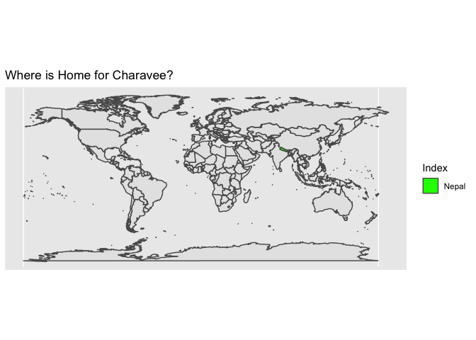
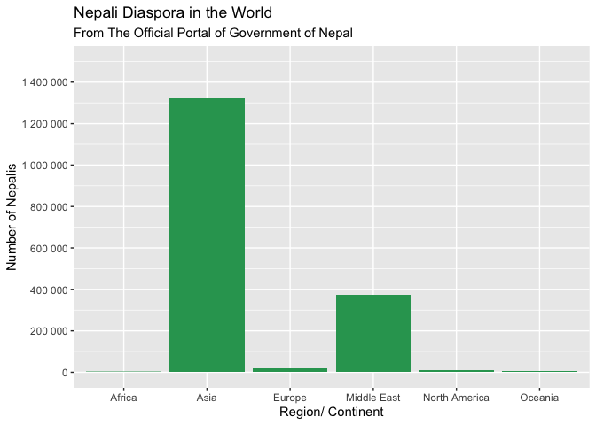

Nepalis Worldwide
================
Charavee Basnet Chettri

### Code in R

``` r
#loadpackages
library (tidyverse)
library(sf)
library(maps)
library(readr)
library(scales)
library(rworldmap)
library(tmaptools)
```

``` r
worldmap <-  maps::map("world", plot = FALSE, fill = TRUE)

worldmap_sf <- worldmap %>% 
  st_as_sf(coords = c("x", "y"), crs=4326)

worldmap_sf_filter <- worldmap_sf %>% 
  filter(ID== "Nepal" )
```

``` r
npl_diaspora <- "npl_diaspora.csv" %>% 
  read_csv()

npl_join <- worldmap_sf %>% 
  left_join (npl_diaspora, by = c( "ID" = "country"))

npl_sum <- npl_diaspora %>% 
  group_by (continent) %>% 
  summarize (total= sum (number))
```

------------------------------------------------------------------------

### Visuals

<!-- -->

<!-- -->

------------------------------------------------------------------------

Sources:

1.  The Official Portal of The Government of Nepal : [link
    here](http://nepal.gov.np:8080/NationalPortal/view-page?id=132)
